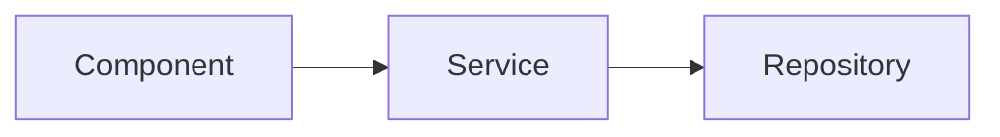
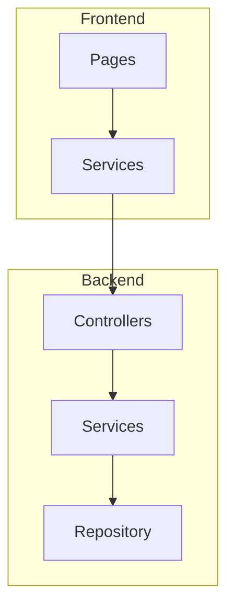

# /wiki — Generate Code Documentation Wiki

Generate comprehensive wiki documentation for this codebase using the CGC knowledge graph.
**Zero LLM API cost** — uses your IDE's built-in AI (Claude Code, Cursor, Copilot).

## When to use

- User types `/wiki` or asks "generate wiki", "document this codebase", "create docs"
- After running `cgc-wiki index .` (or if `.cgc-index/` already exists)

## Prerequisites

If `.cgc-index/graph.duckdb` doesn't exist yet:

```bash
pip install codegraphcontext-rust duckdb
python /path/to/CodeGraphContext/scripts/cgc-wiki.py index .
```

## Step 1: Read the Graph Report

Read `.cgc-index/GRAPH_REPORT.md` to understand:
- **God Nodes** — most connected functions/classes (architecture hubs)
- **API Routes** — full endpoint surface
- **Execution Flows** — what happens when key functions are called
- **Design Rationale** — WHY/NOTE/HACK comments from developers

## Step 2: Query the Graph for Module Details

For each major area (based on god nodes + routes), query DuckDB:

```python
import duckdb
db = duckdb.connect('.cgc-index/graph.duckdb', read_only=True)

# Top functions by connections
top = db.execute("""
    SELECT called_name, called_path, count(*) as cnt
    FROM calls WHERE called_type = 'Function'
    GROUP BY called_name, called_path
    ORDER BY cnt DESC LIMIT 20
""").fetchall()

# All API routes
routes = db.execute("SELECT method, path, handler, file, framework FROM routes ORDER BY path").fetchall()

# Execution flows for a specific file
flows = db.execute("""
    SELECT name, step_count, depth, steps_json
    FROM execution_flows
    WHERE entry_file LIKE '%auth%'
    ORDER BY score DESC LIMIT 5
""").fetchall()

# Functions in a file
funcs = db.execute("""
    SELECT name, line_number, complexity, class_context, docstring
    FROM functions WHERE path LIKE '%auth.service%'
    ORDER BY line_number
""").fetchall()

# Call graph for a file
calls = db.execute("""
    SELECT DISTINCT caller_name, called_name, called_path, confidence
    FROM calls
    WHERE caller_path LIKE '%auth.service%'
      AND caller_type = 'Function'
""").fetchall()

# Design rationale
rationales = db.execute("SELECT tag, text, file, line, context FROM rationales").fetchall()

# Classes with methods
classes = db.execute("""
    SELECT class_context, count(*) as methods
    FROM functions
    WHERE class_context != ''
    GROUP BY class_context
    ORDER BY methods DESC LIMIT 20
""").fetchall()

db.close()
```

## Step 3: Generate Wiki Documents

For each module/area, write a markdown doc following this structure:

```markdown
---
title: "{Module Name}"
type: code-docs
generated_at: {timestamp}
---

# {Module Name}

## Overview
{1-2 paragraph summary of what this module does and why it exists}

## Architecture
{Describe key classes/functions and how they relate}



## API Endpoints
{Table of routes handled by this module}

| Method | Path | Handler | Description |
|--------|------|---------|-------------|
| POST | /auth/login | login() | Authenticate user |

## Key Functions

### {functionName}
- **File:** `path/to/file.ts:42`
- **Calls:** fn1, fn2, fn3 (EXTRACTED)
- **Called by:** handler1, handler2 (INFERRED — cross-file)
- **Complexity:** {N}

{What this function does, based on its calls and context}

## Execution Flows

### Login Flow
When a user logs in:
1. `login()` validates credentials
2. → `generateToken()` creates JWT
3. → `saveSession()` persists to Redis
4. → returns token to client

{Derived from execution_flows table}

## Design Decisions
{From rationale comments in source code}

- **[SAFETY]** in `demoteSuperAdmin`: at least 1 super admin must remain
- **[DECISION]** in `computeTrustScore`: mock location → apply penalty but skip GPS weight

## Dependencies
{What this module depends on (outgoing calls) and what depends on it (incoming calls)}
```

## Step 4: Create Overview Page

Write `overview.md` that links all module docs:

```markdown
# {Project Name} — Code Wiki

## Project Summary
{High-level description based on god nodes + routes + flows}

## Modules
| Module | Files | Functions | Key Purpose |
|--------|-------|-----------|-------------|
| [Authentication](authentication.md) | 5 | 23 | Login, JWT, sessions |
| [API Layer](api-layer.md) | 12 | 45 | REST endpoints |

## API Surface
{Summary of all routes by area}

## Architecture Diagram

```

## Step 5: Output

Write all docs to `wiki-output/` (or directory specified by user):

```
wiki-output/
├── overview.md
├── authentication.md
├── api-layer.md
├── data-layer.md
├── ...
└── design-decisions.md
```

## Tips for High Quality

1. **Use confidence tags** — When describing call relationships:
   - EXTRACTED edges are certain (found in AST)
   - INFERRED edges are cross-file resolutions (likely but not guaranteed)

2. **Include rationale** — Design comments (`NOTE:`, `WHY:`, `HACK:`) are the most
   valuable information for docs. Always include them.

3. **Show execution flows** — "What happens when X is called" is the #1 question
   new developers ask. Trace the flow step by step.

4. **Link API routes to handlers** — Show which functions handle which endpoints.

5. **Use Mermaid diagrams** — Architecture + flow diagrams make docs 3x more useful.

6. **Don't list everything** — Focus on god nodes (top 20 connected) and key flows.
   Skip trivial getter/setter functions.

## Example: /wiki for NestJS project

```
User: /wiki
AI: I'll generate wiki documentation for smart-attendance.

Reading .cgc-index/GRAPH_REPORT.md...
- 423 functions, 214 classes
- 35 API routes (NestJS)
- 161 execution flows
- Key areas: auth, attendance, branches, employees, dashboard

Generating docs:
1. overview.md ✓
2. authentication.md ✓ (4 routes: login, logout, refresh, me)
3. attendance.md ✓ (3 routes: check-in, check-out, me)
4. branches.md ✓ (9 routes: CRUD + geofences + wifi)
5. employees.md ✓ (6 routes: CRUD + devices + assignments)
6. dashboard.md ✓ (3 routes: admin, anomalies, manager)
7. reports.md ✓ (3 routes: export + download)
8. design-decisions.md ✓ (1 rationale: trust score)

Wiki generated: 8 documents in wiki-output/
```
