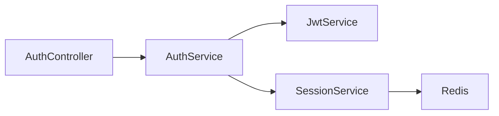

# /wiki — Generate Code Documentation Wiki

Generate comprehensive wiki documentation using pre-computed module contexts.
**Zero LLM API cost** — uses your IDE's built-in AI.

## When to use

User types `/wiki` or asks "generate wiki", "document this codebase", "create docs"

## Prerequisites

If `.cgc-index/module_contexts/` doesn't exist, run first:
```bash
wiki-forge init --no-llm .
# Or: cgc-wiki index .
```

## Step 1: Read the index

Read `.cgc-index/module_contexts/index.md` to see all modules.

## Step 2: Generate docs for each module

For each module listed in index.md:

1. Read `.cgc-index/module_contexts/{slug}.md`
2. The file contains ALL context needed: functions, classes, routes, flows, rationale, source code
3. Follow the "Instructions for AI Wiki Generator" at the bottom of each file
4. Write the doc to `wiki-output/{slug}.md`

**Important:** Process modules ONE AT A TIME. Read context → generate doc → move to next.

## Step 3: Generate overview

After all modules are done, generate `wiki-output/overview.md`:

1. Read `.cgc-index/GRAPH_REPORT.md` for god nodes + summary
2. List all modules with brief descriptions
3. Include a Mermaid architecture diagram
4. Link to each module doc using `[Module Name](module-slug.md)`

## Output structure

```
wiki-output/
├── overview.md              # Project overview + architecture
├── authentication.md        # Module doc
├── api-layer.md            # Module doc
├── data-layer.md           # Module doc
└── ...
```

## Quality guidelines

- Each module doc should have: Overview, Architecture (Mermaid), Key Functions, API Endpoints, Execution Flows, Design Decisions
- Use confidence tags: EXTRACTED = certain, INFERRED = cross-file
- Include design rationale (NOTE/WHY/HACK comments) — these explain "why"
- Show execution flows step-by-step — most valuable for onboarding
- Link between modules using `[[module-slug]]` wikilinks

## Example output

For a module context with 4 NestJS routes and 3 execution flows, generate:

```markdown
# Authentication Module

## Overview
Handles user authentication via JWT tokens with session management.

## Architecture


## API Endpoints
| Method | Path | Handler | Description |
|--------|------|---------|-------------|
| POST | /auth/login | login | Authenticate with credentials |
| POST | /auth/refresh | refresh | Refresh JWT token |

## How It Works

### Login Flow
When a user calls POST /auth/login:
1. AuthController.login() receives LoginDto
2. AuthService.validateCredentials() checks password
3. JwtService.generateToken() creates JWT
4. SessionService.saveSession() persists to Redis
5. Returns LoginResponse with token

## Design Decisions
- **[SAFETY]** At least 1 super admin must remain in the system
```
