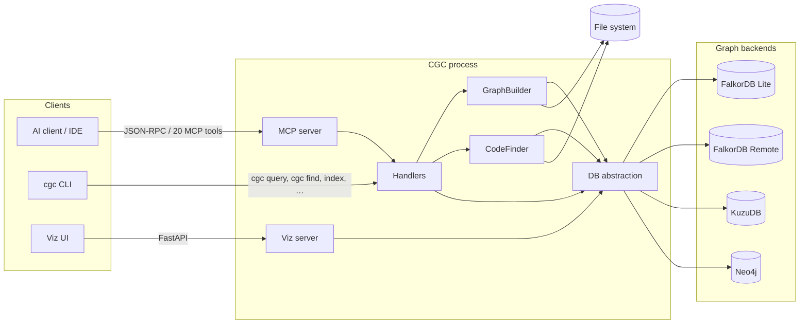

# System architecture

CodeGraphContext (CGC) **0.4.2** is a **context-aware code intelligence engine** that connects your repository to AI tools through an exact **knowledge graph** (not embeddings-only). It runs primarily as an **MCP server** with a **CLI** for indexing and queries, and optional **visualization**.

## High-level architecture

The runtime splits into **clients** (IDE/MCP, CLI, viz browser), a **protocol and handler layer**, **indexing and query services**, a **database abstraction layer**, and **four pluggable graph backends**.

- **MCP path:** IDE → MCP server → **Handlers** → GraphBuilder / CodeFinder / DB layer.
- **CLI path:** Terminal → **Handlers** (same core; CLI uses `cgc query`, not `cgc cypher`, and `cgc find`, not `cgc search`).
- **Viz path:** Browser → **Viz server** (FastAPI + React) → DB layer for exploratory graph views.

## Core components (`src/codegraphcontext`)

| Component | Responsibility |
| :-------- | :------------- |
| **MCP server** | Host for the [Model Context Protocol](https://modelcontextprotocol.io/): maps client tool calls to handler logic. Exposes **20 MCP tools** for indexing, graph queries, context bundles, and related operations. |
| **Handlers** | Shared entry point for MCP and CLI: validation, routing, and orchestration of indexing, search, and query workflows. |
| **GraphBuilder** | Indexing pipeline: walks the repo, runs parsers (Tree-sitter by default), resolves symbols and edges, and writes nodes/relationships through the DB abstraction. |
| **CodeFinder** | Code-aware discovery and relationship traversal over the graph (used by tools that need structured navigation, not raw file grep). |
| **Database abstraction** | Single query/index API over **FalkorDB Lite** (default on Unix with Python 3.12+), **FalkorDB Remote**, **KuzuDB** (embedded fallback, common on Windows), and **Neo4j** (enterprise/production). |
| **Bundle / registry** | **Shipped** bundle registry and packaging for sharing or reusing graph context; integrates with indexing and MCP workflows. |
| **Watchers & jobs** | Long-running or incremental work (full/incremental indexing, file watchers) without blocking the MCP session. |

## Parsing and optional SCIP

- **Default:** **Tree-sitter** across **19 language parsers** for AST-driven nodes and edges.
- **Optional:** **SCIP**-based indexing is **opt-in** when you want indexer output aligned with SCIP semantics instead of (or alongside) Tree-sitter, depending on your configuration.

## Front-ends and observability

1. **AI IDEs** — Primary UX: chat and agents call MCP tools; the graph grounds answers in real paths, symbols, and relationships.
2. **CLI (`cgc`)** — Initialize, index, query (`cgc query`), search (`cgc find`), bundles, and maintenance.
3. **Visualization** — Local **FastAPI** backend plus **React** front-end (not Next.js) for force-directed or similar graph views.
4. **Native DB tools** — FalkorDB/Kuzu/Neo4j-specific browsers or CLIs for low-level Cypher or vendor exploration.

## Typical data flow

1. **Indexing** — `cgc index` (or MCP equivalents) runs GraphBuilder: respect `.cgcignore`, parse files, emit graph entities, merge into the active backend.
2. **Querying** — A tool asks “who calls X?”; handlers validate and run graph logic via the abstraction layer; results return concrete locations and structure.

## Key technologies

| Area | Choice |
| :--- | :----- |
| **Runtime** | Python **3.10+**; **FalkorDB Lite** default path requires **Python 3.12+** on Unix |
| **Parsing** | Tree-sitter (default); **SCIP** optional |
| **Protocol** | MCP (Model Context Protocol) |
| **Graph stores** | **FalkorDB Lite**, **FalkorDB Remote**, **KuzuDB**, **Neo4j** |
| **CLI** | **Typer** |
| **Viz** | **FastAPI** + **React** |

This architecture keeps **one graph contract** across backends so MCP tools and the CLI stay stable regardless of which database you select.
