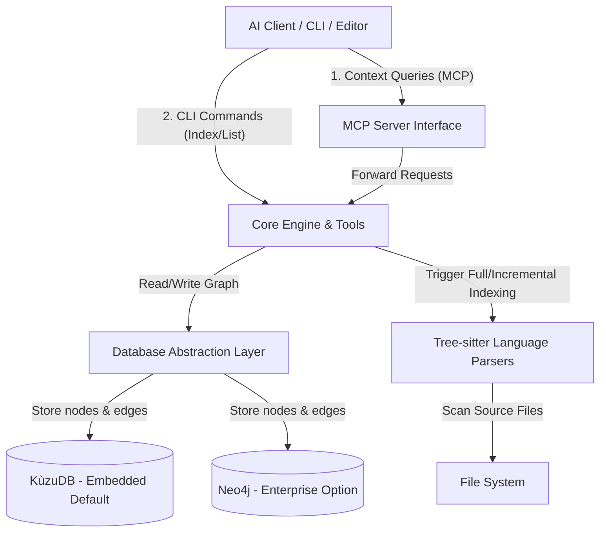

# System Architecture

CodeGraphContext (CGC) is a **context-aware code intelligence engine** that bridges the gap between your source code and your AI tools.

It operates primarily as a background service (MCP Server) backed by a graph database, with a CLI for management. Instead of relying solely on vector embeddings, CodeGraphContext leverages an exact knowledge graph for deep, deterministic insights into the codebase.

## High-Level Architecture Diagram

## 1. The Core (Backend)

The primary intelligence resides within the `src/codegraphcontext` directory. The system is built purely in Python and heavily relies on abstracting operations to stay versatile.

| Component | Responsibility |
| :--- | :--- |
| **MCP Server (`server.py`)** | Acts as the [Model Context Protocol (MCP)](https://modelcontextprotocol.io/) host. It translates JSON-RPC requests from LLM clients (like Claude, Cursor, Windsurf) into standardized graph database queries. |
| **Graph Builder (`graph_builder.py`)** | The "indexer" module. It coordinates parsing the codebase using **Tree-sitter**, extracts dependencies, and builds the knowledge graph layout in memory before flushing objects to the database. |
| **Database Abstraction Layer** | Handles the connection to the underlying graph database. By default, CGC uses **KùzuDB** for embedded, fast, local indexing, but also natively supports **Neo4j** for complex or enterprise-level deployments. |
| **Watchers & Background Jobs** | Manages long-running tasks such as full repository indexing, bundle processing, and file system monitoring (`watchdog` module) that triggers incremental updates upon file modifications without blocking the AI. |
| **Tree-sitter Parsers** | Provide accurate, robust Abstract Syntax Tree (AST) parsing across multiple supported languages to identify classes, functions, files, modules, and their inter-relationships (CALLS, IMPORTS, INHERITS, CONTAINS). |

## 2. Front-ends and Observability

**Important:** CodeGraphContext does **not** rely on a built-in heavy GUI application.

The interaction is designed for low friction and automation:
1.  **AI IDE Integrations:** The primary front-end is your AI IDE chat via the Model Context Protocol. You ask a question ("How does user authentication work in the `users` module?"), and the MCP server uses the graph to resolve exactly what files and functions fulfill that context.
2.  **CLI (Command Line Interface):** A fully featured standard CLI (`cgc`) to initialize, index, clean, or export graph bundles from the terminal.
3.  **Visualization Dashboard:** A standalone React visualization client (`cgc visualize`) that parses the raw graph DB and plots nodes dynamically using `react-force-graph` for exploratory views without needing an external desktop app.
4.  **Database Browsers:** Deep advanced exploration of the actual graph connections using direct Cypher queries via the KùzuDB CLI or Neo4j Browser (`localhost:7474`).

## 3. Data Flow

1.  **Repository Indexing:**
    *   `cgc index .` invokes the graph builder.
    *   Files are skipped/filtered based on `.cgcignore` configurations.
    *   Files are parsed via language-specific Tree-sitter grammars.
    *   Language parsers emit standardized objects (Classes, Functions, Modules).
    *   The Graph Builder reconciles imports (edges across different files) and saves them robustly into the active DB.
2.  **Real-time querying:**
    *   An LLM needs context for "Who calls `authenticate_user`?".
    *   The MCP client forwards the tool call: `analyze_code_relationships(queryType="find_callers", target="authenticate_user")`.
    *   The MCP server runs strict Cypher validation against the Database Abstraction Layer.
    *   DB returns specific file paths, snippet boundaries, and exact structural context natively avoiding hallucination.

## 4. Key Technologies
*   **Language:** Python 3.10+
*   **Parsing:** Tree-sitter (for reliable and multi-language AST extraction)
*   **Protocol:** Model Context Protocol (MCP) by Anthropic for seamless IDE interactions
*   **Databases:**
    *   **KùzuDB:** Used as the default, lightweight embeddable C++ graph database supporting native Cypher compatibility.
    *   **Neo4j:** Production-level graph DB compatibility via Cypher standardizing queries.
*   **CLI Interface:** `click` and `typer` frameworks.
*   **Visualizations:** Next.js / Vite / `react-force-graph` within the `website` directory for rendering the 3D local graph views.
