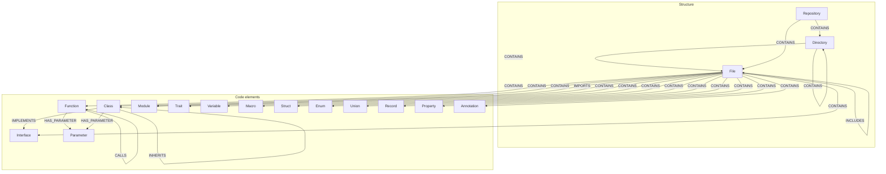

# The graph model

“What does code as a graph look like in CGC?”

The indexer writes a **fixed set of node labels** and **relationship types** so MCP tools, the CLI, and all four database backends speak the same schema. The canonical definitions live in `schema_contract.py` in the package; this page summarizes them for docs and query authors.

## Node labels

These are the **node labels** emitted by indexing (query-only or dynamic labels may appear in ad hoc Cypher but are not part of the core write contract):

| Label | Typical meaning |
| :---- | :-------------- |
| `Repository` | Root / project scope for the indexed tree. |
| `Directory` | A folder in the repository. |
| `File` | A source file on disk. |
| `Function` | A function or method definition. |
| `Class` | A class (or similar type) definition. |
| `Trait` | A trait (languages that model traits). |
| `Variable` | A variable declaration or binding. |
| `Interface` | An interface type. |
| `Macro` | A macro definition. |
| `Struct` | A struct type. |
| `Enum` | An enumeration. |
| `Union` | A union type. |
| `Record` | A record / product type where modeled. |
| `Property` | A property or field member. |
| `Annotation` | An annotation or attribute. |
| `Module` | A logical module or import target. |
| `Parameter` | A formal parameter. |

Imports and dependencies are modeled with **`Module`** nodes and **`IMPORTS`** (and related) **relationships**, not a separate `Import` label.

## Relationship types

| Type | Typical use |
| :--- | :---------- |
| `CONTAINS` | Structural containment (for example repository → directory → file, or file → function). |
| `CALLS` | Caller invokes callee. |
| `IMPORTS` | File or module depends on another module/symbol via an import. |
| `INHERITS` | Subtype extends or inherits from a supertype. |
| `HAS_PARAMETER` | Callable or similar entity has a parameter. |
| `INCLUDES` | Inclusion / include-style dependency where modeled. |
| `IMPLEMENTS` | Type implements an interface or contract. |

Exact semantics can vary slightly by language front-end, but types and labels stay within this contract.

## Diagram (overview)



!!! tip

    For merge keys and property expectations used in indexing, see `FUNCTION_MERGE_KEYS`, `CLASS_MERGE_KEYS`, and related constants in `schema_contract.py`.

## Example query

```cypher
// Classes that inherit from BaseModel
MATCH (c:Class)-[:INHERITS]->(p:Class {name: 'BaseModel'})
RETURN c.name, c.path
```

```cypher
// Functions in a file that call a named callee
MATCH (f:File {path: $path})-[:CONTAINS]->(caller:Function)-[:CALLS]->(callee:Function {name: $name})
RETURN caller.name, caller.line_number
```

Replace property filters with the identifiers your indexer stored for your repo (paths are typically absolute as in the contract).
